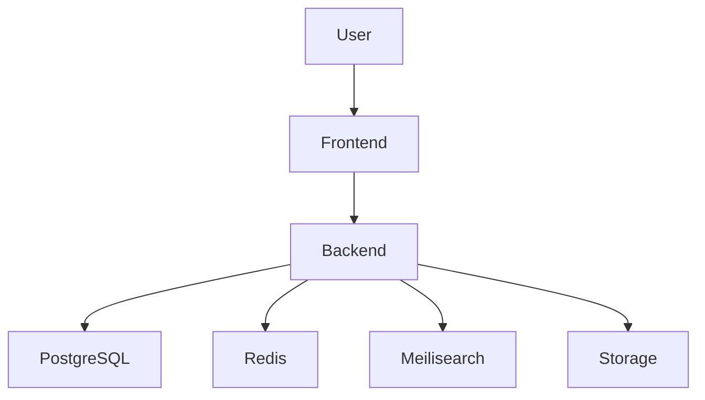

# PopVerse Architecture

## Overview

PopVerse follows a Modular Monolith architecture.

The application consists of a Next.js frontend, a FastAPI backend, PostgreSQL for persistent storage, Redis for caching, Meilisearch for full-text search, and object storage for media assets.

The system is designed for scalability, maintainability, and future migration to microservices if required.

## Architecture Principles

- Modular Monolith
- Clean Architecture
- Domain Driven Design (DDD)
- API First
- Feature Based Development
- Database Normalization
- Stateless Backend
- Asynchronous Tasks for Heavy Operations
- Cloud Ready

## Technology Stack

Frontend

- Next.js
- React
- TypeScript
- Tailwind CSS

Backend

- FastAPI
- Python

Database

- PostgreSQL

Cache

- Redis

Search

- Meilisearch

Storage

- S3 Compatible Storage

Authentication

- JWT

Deployment

- Docker
- Nginx

## High Level Architecture

## Backend Modules

- Authentication
- Users
- Content
- Logs
- Ratings
- Reviews
- Lists
- Search
- Recommendations
- Notifications
- Channels
- Awards
- Analytics
- Admin

## Frontend Modules

- Authentication

- Discover

- Search

- Content Details

- Reviews

- Ratings

- Lists

- Profile

- Friends

- Notifications

- Settings

- Admin

Request

↓

Router

↓

Service

↓

Repository

↓

Database

backend/

frontend/

docs/

database/

assets/

## External Integrations

The architecture supports external APIs for metadata enrichment, availability, and recommendations.
